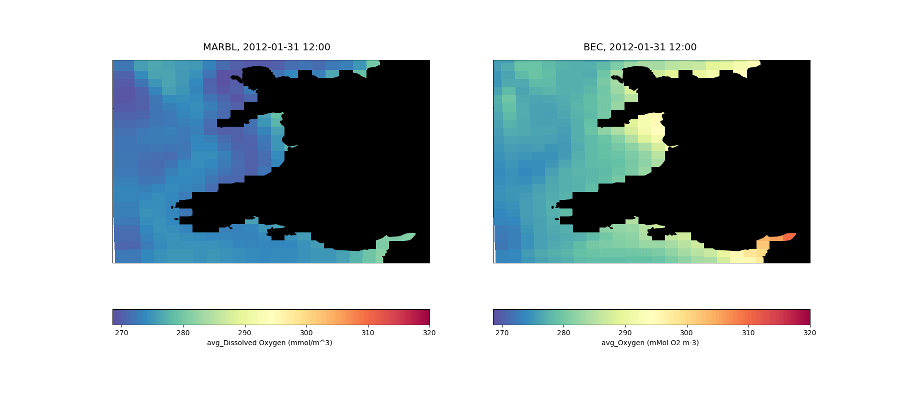

# roms_marbl_example
An example configuration of [ucla-roms](https://github.com/CESR-lab/ucla-roms) with a 24x24, 10km resolution domain of the Welsh coast, configured to be run on an M2 Macbook Pro.
BGC is handled by either [BEC]( https://doi.org/10.1029/2004GB002220) or [MARBL](https://doi.org/10.1029/2021MS002647) with BGC initial and boundary conditions taken from an existing run of CESM.

If you want to run on a different personal computer and need assistance, reach out!



## Installation
This configuration requires installs of [ucla-roms on the roms_marbl branch](https://github.com/dafyddstephenson/ucla-roms/releases/tag/v0.0.0) and [MARBL](https://github.com/marbl-ecosys/MARBL/), and has been set up to be run on Mac OSX with ARM64 architecture (2020 or later Macs with Apple silicon). 
ROMS can be compiled on OSX using the following steps

1. Set up a conda environment 

```
conda create -n roms_marbl
conda install -c conda-forge compilers
conda install netcdf-fortran -c conda-forge
conda install -c conda-forge nco ncview
```
(Any python packages should also be installed from `conda-forge` to prevent clashes).

2. Clone [MARBL](https://github.com/marbl-ecosys/MARBL/) into a local directory (that we'll refer to as `$MARBL_ROOT`), and compile it using the new conda environment (this configuration is working with [`marbl0.45`](https://github.com/marbl-ecosys/MARBL/releases/tag/marbl0.45.0)).
Checkout the [`development` branch](https://github.com/marbl-ecosys/MARBL/tree/development). In `$MARBL_ROOT/src/Makefile` set `USEMPI=TRUE` and run `make`, which should produce the file `libmarbl-gnu-mpi.a` at `$MARBL_ROOT/lib/`.
3. Clone [ROMS](https://github.com/dafyddstephenson/ucla-roms/releases/tag/v0.0.0) into a local directory (that we'll refer to as `$ROMS_ROOT`).
4. Create a `.ROMS` text file in your home directory (this is the convention used in the running scripts contained in this repo), and `source` it (`source ~/.ROMS`) so as to set certain environment variables:

```
CONDA_ENV=roms_marbl

export ROMS_ROOT=<the local location of the [ucla-roms repo](https://github.com/CESR-lab/ucla-roms)>
export MPIHOME=${CONDA_PREFIX} #e.g. /Users/you/miniconda3/envs/roms_marbl
export NETCDFHOME=${CONDA_PREFIX}
export MARBL_ROOT=<the local location of the [MARBL repo](https://github.com/marbl-ecosys/MARBL/)>
export LD_LIBRARY_PATH="$LD_LIBRARY_PATH:$NETCDFHOME/lib"
export PATH="./:$PATH"
export PATH=$PATH:$ROMS_ROOT/Tools-Roms
```

5. Compile ROMS:
    1. First, place this repo into a subdirectory of `ucla-roms` (`$ROMS_ROOT/Examples/` is recommended). 
    2. Replace certain ROMS files with the ones included in the `Macbook_files_to_replace` subdirectory of this repo using `rsync -av $ROMS_ROOT/Examples/roms_marbl_example/Macbook_files_to_replace/* $ROMS_ROOT`. This will allow compilation on a Mac with ARM64.
    3. Go to `$ROMS_ROOT/Work` and run `make nhmg`
    4. Go to `$ROMS_ROOT/Tools-Roms` and run `make`
    5. Lastly, go to `code` in this repo and run `make`, which should produce an executable (`roms`) locally.

Compile time notes:
- The number of CPUs is set at compile time (see below, default number is 9).
- By default, ROMS will compile with BGC being handled by MARBL.
- To switch to BEC, comment (prepend a `!` to) `#define MARBL` in `code/cppdefs.opt`, uncomment `#define BIOLOGY_BEC2`, run `make` again.
   To run without BGC, comment both cpp keys.

## Running
All of the initial and boundary condition files to run for the year of 2012 are provided in `INPUT` for both BEC and MARBL. 
To run the model, simply run the script `fromrestart_run.sh` in a terminal, which will determine whether the MARBL cpp key is active and choose the necessary input files and namelists accordingly.
The model will restart on the 3rd of January 2012 (restart files are included for MARBL and BEC, but both runs previously started from identical initial conditions)
The input files are split (one per processor) using the `partit` tool in `$ROMS_ROOT/Tools-Roms` which should be on your path after being added by the `.ROMS` file in Step 3, then the model is run.
The output files are similarly joined using the `ncjoin` tool.

## Running with modified settings
The layout of processors is set (`NP_XI`,`NP_ETA`) in `code/param.opt` should you wish to change from the default (3,3), but the model will need to be recompiled, and the `.sh` files will need to be updated before running.
The output frequency is set in `code/ocean_vars.opt`. A recompile will be necessary to change this.

## MODIFICATIONS FROM ROMS SOURCE CODE
- addition of the `marbl_driver` module, which interfaces between MARBL and ROMS
- addition of the `bulk_wnd` module, which prevents a circular dependency when providing wind to MARBL. Largely mirrors `bulk_frc`.
- Modifications to `grid`,`bgc`,`tracers`, and `read_write` modules to allow compilation with `gfortran` (ensuring character arrays have entries of equal length, and `.eqv.` is used over `==`)
- addition of a `#MARBL` cpp key
- activation of `NOX` and `NHY` forcing (previously incomplete but needed for MARBL; activated with `#NOX_FORCING` and `NHY_FORCING`)
- modifications to `step3d_t_ISO` and `tracers` modules to interface with MARBL
- Changes to `Makefile` and `Makedefs.inc` to allow compilation on non-case-sensitive file systems (OSX default behaviour):
     - Preprocessed `.F` files now use a `.fpp` extension and are not deleted.
     - `Make.depend` is not generated at compile time, but fixed and copied from `code`. `makedepf90` does not appear to work in the above conda environment.
     - Compiler flags added to incorporate MARBL.
