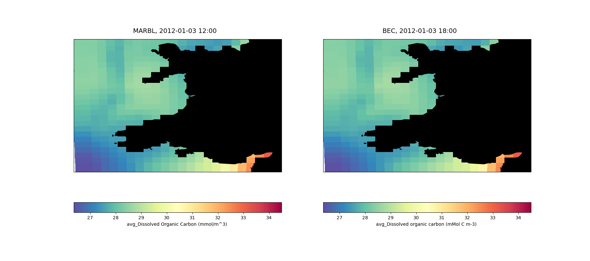

# roms_marbl_example
An example configuration of [ucla-roms](https://github.com/CESR-lab/ucla-roms) with a 24x24, 10km resolution domain of the Welsh coast.
BGC is handled by either [BEC]( https://doi.org/10.1029/2004GB002220) or [MARBL](https://doi.org/10.1029/2021MS002647) with BGC initial and boundary conditions taken from an existing run of CESM.

## Installation
This requires installs of [ucla-roms](https://github.com/CESR-lab/ucla-roms) and [MARBL](https://github.com/marbl-ecosys/MARBL). 
It is currently recommended (2024-06-20) to use [my fork of ROMS](https://github.com/dafyddstephenson/ucla-roms) checked out to the `marbl_improvements_20240611` branch. MARBL should be checked out to `marbl0.45.0`.
If you are unsure how to install these dependencies, you may want to try installing via C-Star on another branch of this respository. With ROMS and MARBL installed:

- Clone this repo to a suitable directory (e.g. `$ROMS_ROOT/Examples/roms_marbl_example` or `$ROMS_ROOT/Work/roms_marbl_example`)
- Obtain the input files (initial and boundary conditions, surface forcing) using `./get_input_files.sh`
- run `make` in `code`. Note that if you are on a non-intel system such as OSX or perlmutter you will need to run `make COMPILER=gnu`. If you are unsure, see whether `mpifort --version` returns GNU or ifort.
- After successfully compiling, start the run with `submit_job.sh`. This will figure out which system you are on and send a job to the appropriate scheduler using the account key saved in the `${ACCOUNT_KEY}` environment variable.
Compile time notes:
- The number of CPUs is set at compile time (see below, default number is 9).
- By default, ROMS will compile with BGC being handled by MARBL.
- To switch to BEC, comment (prepend a `!` to) `#define MARBL` in `code/cppdefs.opt`, uncomment `#define BIOLOGY_BEC2`, run `make` again.
   To run without BGC, comment both cpp keys.

## Running
All of the initial and boundary condition files to run for the year of 2012 will be downloaded to INPUT for both BEC and MARBL. 
Start the run with `submit_job.sh`. This will figure out which system you are on and send a job to the appropriate scheduler. If you are on a supported HPC system, you will need to have your account key set as the environment variable `ACCOUNT_KEY`. The script will determine whether the MARBL cpp key is active and choose the necessary input files and namelists accordingly.

The model will restart on the 3rd of January 2012 (restart files are included for MARBL and BEC, but both runs previously started from identical initial conditions)
The input files are split (one per processor) using the `partit` tool in `$ROMS_ROOT/Tools-Roms` which should be on your path after being added by the `.ROMS` file in Step 3, then the model is run.
The output files are similarly joined using the `ncjoin` tool.

## Controlling output variables 
By default, The model will run for 28 days (set in `roms.in_MARBL`) and 32 MARBL tracers will be written to the output files `MARBL_bgc.??????????????.nc` every 6 hours (set using `output_period_his` in `bgc.opt`). Model state variables unrelated to biogeochemistry are written to `MARBL_his.??????????????.nc` every 6 hours, set using `output_period_his` in `ocean_vars.opt`. To choose which MARBL tracers are written to the file, edit the text file `marbl_tracer_output_list`. 

Additionally, a further 343 diagnostic variables are available in the default MARBL configuration. To run with diagnostic output, edit `code/cppdefs.opt` so the line `#MARBL_DIAGS` is uncommented (delete the `!`), and run `make` in the `code` directory, before running the model. By default, BGC diagnostic output is written to `MARBL_bgc_dia.??????????????.nc` every 6 hours (set using `output_period_his_dia` in `bgc.opt`). To choose which MARBL diagnostics are written to the file, edit the text file `marbl_diagnostic_output_list`. 

## Running with modified settings
The layout of processors is set (`NP_XI`,`NP_ETA`) in `code/param.opt` should you wish to change from the default (3,3), but the model will need to be recompiled, and the `.sh` files will need to be updated before running.
The output frequency is set in `code/ocean_vars.opt`. A recompile will be necessary to change this.
